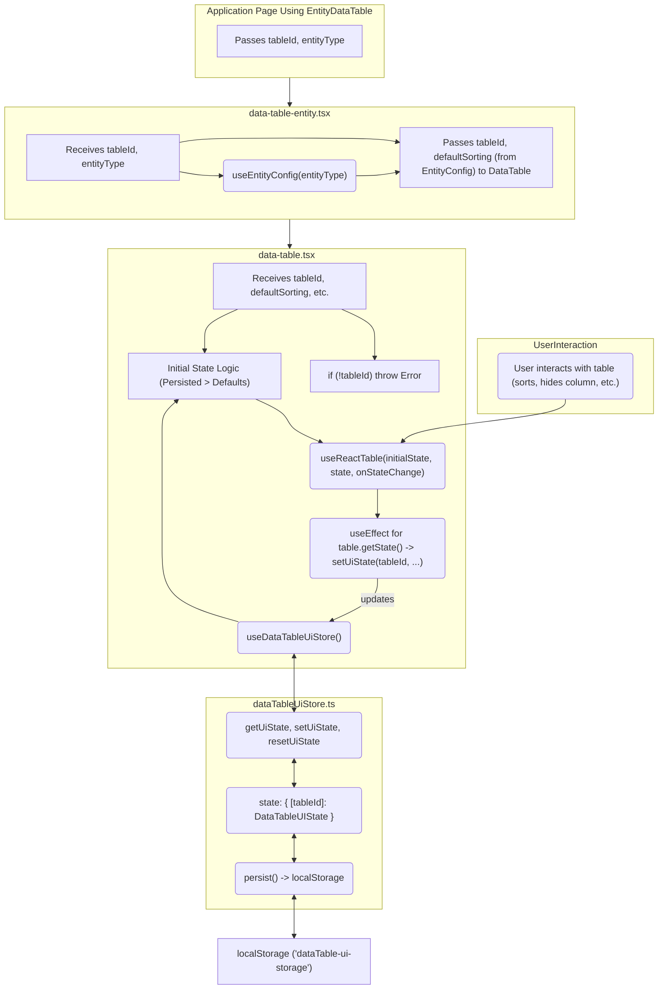

# Data Table UI State Persistence Plan

## 1. Goal

To implement persistence for data table UI features (sorting, column visibility, column order, column sizing, column filters, and pagination state) using Zustand and localStorage. The persisted state should be unique per table instance, identified by a `tableId`.

## 2. Key Decisions

*   **Persistence Keying:** State will be keyed by a unique `tableId` prop provided to the `DataTable` component.
*   **`tableId` Prop:** This prop will be **required** for `DataTable`. If not provided, an error will be thrown during development.
*   **Zustand Store:** A **new, separate Zustand store** will be created for data table UI states (e.g., `apps/web/src/stores/dataTableUiStore.ts`).
*   **Sorting State Management:** Zustand-led. `DataTable` will manage its sorting state internally, prioritizing persisted state from Zustand. Props like `defaultSorting` will serve as initial non-persisted defaults if no persisted state is found.
*   **State Priority:** Persisted state from Zustand will always take precedence over prop-based or configuration-based defaults.

## 3. Detailed Plan

### Phase 1: Zustand Store Setup

1.  **Create New Store File:**
    *   Path: `apps/web/src/stores/dataTableUiStore.ts`
2.  **Define State Interfaces:**
    ```typescript
    // In apps/web/src/stores/dataTableUiStore.ts
    import { SortingState, VisibilityState, ColumnOrderState, ColumnSizingState, ColumnFiltersState, PaginationState } from '@tanstack/react-table';

    export interface DataTableUIState {
      sorting?: SortingState;
      columnVisibility?: VisibilityState;
      columnOrder?: ColumnOrderState;
      columnSizing?: ColumnSizingState; // For column widths
      columnFilters?: ColumnFiltersState;
      pagination?: Pick<PaginationState, 'pageIndex' | 'pageSize'>; // Persist only pageIndex and pageSize
    }

    export interface AllDataTableUIStates {
      [tableId: string]: DataTableUIState; // Keyed by tableId
    }

    interface DataTableUiActions {
      getUiState: (tableId: string) => DataTableUIState | undefined;
      setUiState: (tableId: string, newState: Partial<DataTableUIState>) => void;
      resetUiState: (tableId: string) => void;
    }
    ```
3.  **Implement Zustand Store (`useDataTableUiStore`):**
    *   Use `create` from `zustand`.
    *   Use `persist` middleware from `zustand/middleware`.
    *   Configuration for `persist`:
        *   `name: 'dataTable-ui-storage'` (localStorage key).
        *   `storage: createJSONStorage(() => localStorage)`.
    *   Initial state for `AllDataTableUIStates` will be `{}`.
    *   Implement actions:
        *   `getUiState(tableId)`: Returns `state[tableId]`.
        *   `setUiState(tableId, newState)`: Updates `state[tableId]` by merging `newState`.
        *   `resetUiState(tableId)`: Removes `state[tableId]` or sets it to an empty object.

### Phase 2: Integrating `DataTable` and `EntityDataTable`

1.  **Modify `apps/web/src/components/data-table/data-table.tsx`:**
    *   **Props:**
        *   Add `tableId: string` (make it a required prop).
        *   `sorting` and `setSorting` props become optional (will be used for `defaultSorting` if provided).
        *   Add `defaultSorting?: SortingState` (optional, for initial non-persisted sort if no persisted state or `EntityConfig` default).
        *   Add similar optional `defaultColumnVisibility`, `defaultColumnOrder`, etc. props if fine-grained non-persisted defaults are needed beyond `EntityConfig`.
    *   **Error Handling:**
        *   At the start of the component: `if (!props.tableId) { throw new Error('DataTable: tableId prop is required.'); }`
    *   **Zustand Hook:**
        *   `const { getUiState, setUiState } = useDataTableUiStore();`
    *   **State Initialization Logic:**
        *   `const persistedState = getUiState(props.tableId);`
        *   Determine initial states for `sorting`, `columnVisibility`, `columnOrder`, `columnSizing`, `columnFilters`, `pagination`. Priority:
            1.  Values from `persistedState` (if they exist).
            2.  Values from `props.defaultSorting` (and similar default props).
            3.  Values derived from `EntityConfig` (passed as default props from `EntityDataTable`).
            4.  Standard `react-table` defaults.
        *   Store these initial states in local `React.useState` variables (e.g., `useState<SortingState>(initialSortingFromLogicAbove)`).
        *   Pass these local state variables and their setters to `useReactTable` (e.g., `state: { sorting: localSortingState }, onSortingChange: setLocalSortingState`).
    *   **State Persistence (Using `useEffect`):**
        *   For each state (sorting, columnVisibility, etc.):
            ```typescript
            useEffect(() => {
              if (table.getState().sorting !== undefined) { // Or a more robust check if it has actually changed from initial
                setUiState(props.tableId, { sorting: table.getState().sorting });
              }
            }, [table.getState().sorting, props.tableId, setUiState]);
            ```
            *   Repeat this pattern for `columnVisibility`, `columnOrder`, `columnSizing`, `columnFilters`, and `pagination` (only `pageIndex` and `pageSize`).
            *   Ensure dependencies are correct to avoid infinite loops or stale closures.
            *   The condition `table.getState().sorting !== undefined` might need refinement to ensure it only saves after actual user interaction or programmatic changes, not just initial setup. Comparing with previous state might be more robust.

2.  **Modify `apps/web/src/components/data-table/data-table-entity.tsx`:**
    *   **Props:**
        *   Add `tableId: string` (make it a required prop).
    *   **Functionality:**
        *   Pass the received `tableId` prop down to the `<DataTable tableId={props.tableId} ... />`.
        *   Continue to use `entityType` to fetch `EntityConfig` from `useEntityConfig(entityType)`.
        *   Pass defaults from `entityConfig` (e.g., `defaultSorting={entityConfig?.defaultSorting}`) to `DataTable`. These will be used by `DataTable` if no persisted state for the given `tableId` is found.

3.  **Modify `apps/web/src/components/data-table/data-table-columns.tsx`:**
    *   No direct changes for Zustand integration are expected. It manipulates the `table` instance, and `DataTable` will pick up these changes via `table.getState()` for persistence.

### Phase 3: Handling Defaults and Reset Functionality

1.  **Default Values:**
    *   The state initialization logic in `DataTable` (Phase 2.1) will handle the priority: Persisted State > Prop Defaults (`defaultSorting` etc.) > EntityConfig Defaults > React-Table Defaults.
2.  **Reset View Functionality:**
    *   Introduce a "Reset View" button, likely within the `DataTableColumns` component's sheet, or as a standalone button near the table.
    *   This button will require access to the `tableId` and the `resetUiState` action from `useDataTableUiStore`.
    *   **Action on Click:**
        1.  Call `resetUiState(tableId);`
        2.  Trigger `react-table` to reset its individual states:
            *   `table.resetSorting(true);` (pass `true` to reset to initial state rather than empty)
            *   `table.resetColumnVisibility(true);`
            *   `table.resetColumnOrder(true);`
            *   `table.resetColumnSizing(true);`
            *   `table.resetColumnFilters(true);`
            *   `table.resetPagination(true);` (or manually set pageIndex to 0 and pageSize to its default).
        3.  These resets should then cause the local `React.useState` variables in `DataTable` to update, reflecting the default (non-persisted) configuration.

## 4. Mermaid Diagram (Conceptual Flow)



## 5. Future Considerations (Post-MVP)

*   **State Migrations:** If `DataTableUIState` structure changes, a versioning/migration strategy for the `localStorage` data might be needed. Zustand's `persist` middleware has a `migrate` option.
*   **Pruning Old States:** Mechanism to clear `localStorage` entries for `tableId`s that are no longer in use.
*   **UI for Reset:** Clear visual feedback when the view is reset.
*   **Selective Persistence:** Allow disabling persistence for certain aspects (e.g., don't persist filters for a specific table instance).
*   **Shared State:** If some tables of the same `entityType` *should* share state, this plan would need extension (e.g., a secondary key or a different store structure).

This plan provides a clear path forward for implementing the desired persistence functionality.