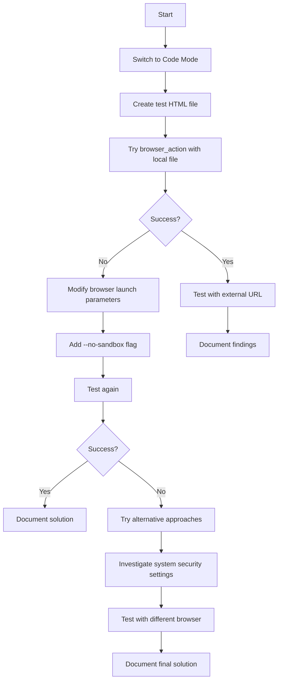

# Browser Action Tool Debugging Plan

## Understanding the Problem

The browser_action tool is failing with the error:
```
No usable sandbox! If you are running on Ubuntu 23.10+ or another Linux distro that has disabled unprivileged user namespaces with AppArmor...
```

This indicates that Chrome cannot create a sandbox environment due to security restrictions in the Fedora Linux environment.

## Potential Solutions

There are several approaches we can take to resolve this issue:

### Solution A: Use the `--no-sandbox` Flag
- The error message suggests using the `--no-sandbox` flag as a workaround
- This disables Chrome's sandbox security feature
- While not ideal for security, it's acceptable for testing purposes

### Solution B: Configure Browser Launch Parameters
- Investigate if there's a way to configure how the browser_action tool launches Chrome
- This might involve modifying configuration files or environment variables

### Solution C: Test with Local Files
- Create a simple HTML file locally and test if the browser can open that
- This helps determine if the issue is specific to external websites

### Solution D: Use an Alternative Browser
- If Chrome is having issues with the sandbox, try using a different browser
- This would require modifying the browser_action tool configuration

## Implementation Steps



## Detailed Implementation Plan

1. **Switch to Code Mode**
   - Use the switch_mode tool to change to Code mode
   - This will allow us to create and modify non-markdown files

2. **Create Test HTML File**
   - Create a simple HTML file with basic content
   - This will be used to test if the browser can open local files

3. **Test Browser Action with Local File**
   - Use the browser_action tool to open the local HTML file
   - Determine if the issue persists with local files

4. **Modify Browser Launch Parameters**
   - If the issue persists, investigate how to add the `--no-sandbox` flag
   - This might involve creating or modifying configuration files

5. **Test with External URL**
   - Once local files work, test with external URLs like Google.com
   - Document any differences in behavior

6. **Document Solution**
   - Create a markdown file documenting the issue and solution
   - Include steps to reproduce and fix the issue

## Security Considerations

- Using `--no-sandbox` disables an important security feature
- This should only be used for testing purposes
- In a production environment, a more secure solution should be implemented    H --> I[Test again]
    I --> J{Success?}
    J -->|Yes| K[Document solution]
    J -->|No| L[Try alternative approaches]
    F --> M[Document findings]
    L --> N[Investigate system security settings]
    N --> O[Test with different browser]
    O --> P[Document final solution]
```

## Detailed Implementation Plan

1. **Switch to Code Mode**
   - Use the switch_mode tool to change to Code mode
   - This will allow us to create and modify non-markdown files

2. **Create Test HTML File**
   - Create a simple HTML file with basic content
   - This will be used to test if the browser can open local files

3. **Test Browser Action with Local File**
   - Use the browser_action tool to open the local HTML file
   - Determine if the issue persists with local files

4. **Modify Browser Launch Parameters**
   - If the issue persists, investigate how to add the `--no-sandbox` flag
   - This might involve creating or modifying configuration files

5. **Test with External URL**
   - Once local files work, test with external URLs like Google.com
   - Document any differences in behavior

6. **Document Solution**
   - Create a markdown file documenting the issue and solution
   - Include steps to reproduce and fix the issue

## Security Considerations

- Using `--no-sandbox` disables an important security feature
- This should only be used for testing purposes
- In a production environment, a more secure solution should be implemented